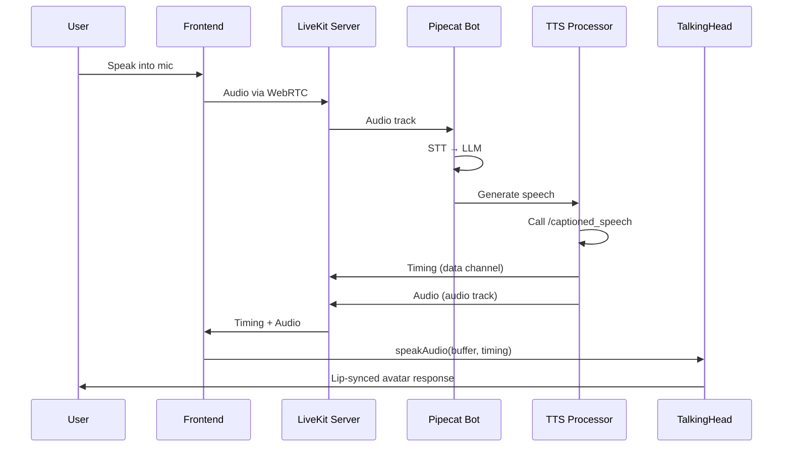

# Integration Plan: Lip-Sync 3D Avatar for Pipechat (LiveKit + RTVI)

## Overview

This plan details the integration of TalkMateAI's lip-sync 3D avatar functionality into the pipechat-voice-agent system using **Pipecat's RTVI protocol with LiveKit transport**. This approach enables both local development and production deployment with self-hosted or cloud LiveKit infrastructure.

## Background & Context

### Current State
**Pipechat-voice-agent:**
- Backend: Pipecat framework (`bot.py`)
- Transport: **WebRTC** (can use Daily or **LiveKit**)
- Pipeline: OpenAI-compatible STT → LLM → TTS
- Interface: Currently uses transport's default UI
- RTVI: Already integrated (`RTVIProcessor`, `RTVIObserver`)
- Deployment: Can run locally or on Pipecat Cloud

**TalkMateAI Reference:**
- Frontend: Next.js 15 with TypeScript
- 3D Avatar: TalkingHead library (met4citizen/TalkingHead@1.4)
- Features: Lip-sync with word-level timing, camera integration
- Communication: Custom WebSocket (to be replaced with **RTVI + LiveKit**)

### Integration Strategy

**Using RTVI Protocol with LiveKit Transport:**

✅ **VERIFIED**: Pipecat's RTVI protocol **fully supports LiveKit transport** via `LiveKitTransport`

**Architecture**:
- **LiveKitTransport**: Pipecat's module for LiveKit WebRTC communication[1]
- **RTVIProcessor**: Handles client-server messaging (works with any transport)
- **RTVIObserver**: Monitors pipeline events, sends to client via RTVI protocol
- **Custom Events**: Extend RTVI to emit word-level timing data
- **Data Channels**: LiveKit's data channels for control messages (timing events)
- **Audio Streams**: LiveKit WebRTC audio tracks for bot speech output

**Benefits**: 
- ✅ Cloud-deployable with Pipecat Cloud OR self-hosted LiveKit
- ✅ Uses Pipecat's standard RTVI protocol (transport-agnostic)
- ✅ Open-source WebRTC infrastructure (no vendor lock-in)
- ✅ Proven integration (documented in Pipecat guides)

### Key Architectural Components

| Component | Technology | Purpose |
|-----------|------------|---------|
| **Backend Transport** | `LiveKitTransport` (Pipecat) | WebRTC audio/video streaming |
| **Protocol Layer** | RTVI (Pipecat backend) | Server-side orchestration |
| **Event Delivery** | LiveKit Data Channels | Timing events, control messages |
| **Frontend Client** | `livekit-client` (JS SDK) | LiveKit room connection |
| **3D Avatar** | TalkingHead.js | Lip-sync rendering |
| **Authentication** | LiveKit Token Server | Secure room access tokens |

---

## Proposed Changes

### Component 1: Custom TTS Processor with Timing

Create a custom processor that wraps the TTS service and emits timing events via RTVI.

#### [NEW] [tts_with_timing_processor.py](file:///media/limcheekin/My%20Passport/ws/py/pipechat-voice-agent/tts_with_timing_processor.py)

**Purpose**: Extends Pipecat's TTS to extract and emit word-level timing data via RTVI events

**Key Features**:
- Wraps `CustomOpenAITTSService`
- Extracts timing from Kokoro TTS `/captioned_speech` endpoint
- Emits custom RTVI events: `bot-tts-timing` with word timestamps
- Falls back to estimation for non-Kokoro TTS
- Maintains audio streaming (doesn't break pipeline)

**Implementation**:
```python
from pipecat.frames.frames import Frame, TTSStartFrame, TTSAudioRawFrame, DataMessageFrame
from pipecat.processors.frame_processor import FrameProcessor, FrameDirection
from typing import AsyncGenerator
import os
import time
import base64
from loguru import logger

class TTSWithTimingProcessor(FrameProcessor):
    """
    Wraps TTS service to emit word-level timing events.
    
    Emits:
    - TTSAudioRawFrame: Audio data (standard)
    - Custom RTVI data message: Word timing data
    """
    
    def __init__(self, tts_service):
        super().__init__()
        self.tts_service = tts_service
    
    async def process_frame(self, frame: Frame, direction: FrameDirection):
        await super().process_frame(frame, direction)
        
        if isinstance(frame, TTSStartFrame):
            # Get timing from TTS backend (via custom endpoint)
            audio, timings = await self._synthesize_with_timing(frame.text)
            
            # Emit timing as RTVI data message (LiveKit will send via data channel)
            # Add sequence ID for robust audio/timing synchronization
            sequence_id = int(time.time() * 1000)  # Millisecond timestamp as sequence
            
            timing_data = {
                "type": "bot-tts-timing",
                "sequence_id": sequence_id,
                "words": [t["word"] for t in timings],
                "word_times": [t["start_time"] for t in timings],
                "word_durations": [t["end_time"] - t["start_time"] for t in timings],
                "text": frame.text
            }
            
            # Send via LiveKit data channel
            await self.push_frame(DataMessageFrame(data=timing_data))
            
            # Continue with audio
            await self.push_frame(TTSAudioRawFrame(audio=audio, sample_rate=24000))
        else:
            await self.push_frame(frame, direction)
    
    async def _synthesize_with_timing(self, text: str):
        """Call custom TTS endpoint with timing support"""
        import httpx
        import json
        
        # Get TTS configuration from environment
        tts_base_url = os.getenv("TTS_BASE_URL")
        tts_api_key = os.getenv("TTS_API_KEY")
        tts_model = os.getenv("TTS_MODEL", "kokoro")
        tts_voice = os.getenv("TTS_VOICE", "af_heart")
        
        # Try native timing endpoint first (Kokoro TTS)
        try:
            async with httpx.AsyncClient() as client:
                response = await client.post(
                    f"{tts_base_url}/captioned_speech",
                    headers={"Authorization": f"Bearer {tts_api_key}"},
                    json={
                        "model": tts_model,
                        "input": text,
                        "voice": tts_voice,
                        "speed": 1.0,
                        "response_format": "pcm",
                        "stream": True,
                    },
                    timeout=30.0,
                )
                
                if response.status_code == 200:
                    # Parse streaming response for audio and timing
                    audio_chunks = []
                    timing_data = []
                    
                    for line in response.iter_lines():
                        if line:
                            try:
                                data = json.loads(line)
                                if "audio" in data:
                                    audio_chunks.append(base64.b64decode(data["audio"]))
                                if "word_timings" in data:
                                    for timing in data["word_timings"]:
                                        timing_data.append({
                                            "word": timing["word"],
                                            "start_time": timing["start"],
                                            "end_time": timing["end"],
                                        })
                            except json.JSONDecodeError:
                                continue
                    
                    audio_bytes = b"".join(audio_chunks)
                    return audio_bytes, timing_data
        
        except (httpx.HTTPError, Exception) as e:
            logger.warning(f"Native timing endpoint failed: {e}, falling back to estimation")
        
        # Fallback: Use standard TTS and estimate timing
        audio_bytes = await self.tts_service.synthesize(text)
        estimated_timing = self._estimate_word_timing(text, len(audio_bytes))
        return audio_bytes, estimated_timing
    
    def _estimate_word_timing(self, text: str, audio_length_bytes: int) -> list:
        """Estimate word timing when native timing unavailable"""
        words = text.split()
        # Assume 24kHz PCM16 = 48000 bytes/second
        duration_seconds = audio_length_bytes / 48000.0
        time_per_word = duration_seconds / max(len(words), 1)
        
        timings = []
        for i, word in enumerate(words):
            start_time = i * time_per_word
            end_time = (i + 1) * time_per_word
            timings.append({
                "word": word,
                "start_time": start_time,
                "end_time": end_time,
            })
        
        return timings
```

**Integration Point**: Insert into pipeline between LLM and standard TTS

---

### Component 2: LiveKit Transport Configuration

Update bot.py to add LiveKit transport support while maintaining the current structure.

#### [MODIFY] [bot.py](file:///media/limcheekin/My%20Passport/ws/py/pipechat-voice-agent/bot.py)

**Changes**:
1. Add LiveKit transport import and params
2. Update `run_bot()` to use timing processor
3. Keep current `create_transport()` pattern

```python
# Add to imports section (after line 54)
from pipecat.transports.services.livekit import LiveKitParams
from tts_with_timing_processor import TTSWithTimingProcessor

# Update run_bot function to include timing processor
async def run_bot(transport: BaseTransport, runner_args: RunnerArguments):
    logger.info(f"Starting bot")

    stt = OpenAISTTService(
        api_key=os.getenv("STT_API_KEY"),
        base_url=os.getenv("STT_BASE_URL"),
        model=os.getenv("STT_MODEL"),
        language=os.getenv("LANGUAGE"),
    )

    tts = CustomOpenAITTSService(
        api_key=os.getenv("TTS_API_KEY"),
        base_url=os.getenv("TTS_BASE_URL"),
        model=os.getenv("TTS_MODEL"),
        voice=os.getenv("TTS_VOICE"),
        language=os.getenv("LANGUAGE"),
    )
    
    # ✅ NEW: Wrap TTS with timing processor
    tts_with_timing = TTSWithTimingProcessor(tts_service=tts)

    llm = OpenAILLMService(
        api_key=os.getenv("LLM_API_KEY"),
        base_url=os.getenv("LLM_BASE_URL"),
        model=os.getenv("LLM_MODEL") or "gpt-4o-mini",
    )

    messages = [
        {
            "role": "system",
            "content": "You are a friendly AI assistant with a 3D avatar. Respond naturally and keep your answers conversational.",
        },
    ]

    context = LLMContext(messages)
    context_aggregator = LLMContextAggregatorPair(context)

    rtvi = RTVIProcessor(config=RTVIConfig(config=[]))

    pipeline = Pipeline(
        [
            transport.input(),
            rtvi,
            stt,
            context_aggregator.user(),
            llm,
            tts_with_timing,  # ✅ Use timing processor instead of plain tts
            transport.output(),
            context_aggregator.assistant(),
        ]
    )

    task = PipelineTask(
        pipeline,
        params=PipelineParams(
            enable_metrics=True,
            enable_usage_metrics=True,
        ),
        observers=[RTVIObserver(rtvi)],
    )

    @transport.event_handler("on_client_connected")
    async def on_client_connected(transport, client):
        logger.info(f"Client connected")
        messages.append({"role": "system", "content": "Greet the user and introduce yourself as their AI assistant with an animated avatar."})
        await task.queue_frames([LLMRunFrame()])

    @transport.event_handler("on_client_disconnected")
    async def on_client_disconnected(transport, client):
        logger.info(f"Client disconnected")
        await task.cancel()

    runner = PipelineRunner(handle_sigint=runner_args.handle_sigint)
    await runner.run(task)


# Update bot() function to add LiveKit transport
async def bot(runner_args: RunnerArguments):
    """Main bot entry point for the bot starter."""

    transport_params = {
        "daily": lambda: DailyParams(
            audio_in_enabled=True,
            audio_out_enabled=True,
            vad_analyzer=SileroVADAnalyzer(params=VADParams(stop_secs=0.2)),
            turn_analyzer=LocalSmartTurnAnalyzerV3(),
        ),
        "webrtc": lambda: TransportParams(
            audio_in_enabled=True,
            audio_out_enabled=True,
            vad_analyzer=SileroVADAnalyzer(params=VADParams(stop_secs=0.2)),
            turn_analyzer=LocalSmartTurnAnalyzerV3(),
        ),
        # ✅ NEW: Add LiveKit transport
        "livekit": lambda: LiveKitParams(
            audio_in_enabled=True,
            audio_out_enabled=True,
            camera_in_enabled=False,  # Set to True for multimodal (vision)
            camera_out_enabled=False,  # Set to True if bot outputs video
            # Optional camera configuration (uncomment if camera enabled):
            # camera_out_width=1280,
            # camera_out_height=720,
            # camera_out_framerate=30,
            vad_analyzer=SileroVADAnalyzer(params=VADParams(stop_secs=0.2)),
            turn_analyzer=LocalSmartTurnAnalyzerV3(),
        ),
    }

    transport = await create_transport(runner_args, transport_params)
    await run_bot(transport, runner_args)
```

**Rationale**: Maintains current bot.py structure while adding LiveKit support alongside existing Daily/WebRTC transports.

**Usage**: Start bot with LiveKit by setting environment variables in `.env` and using:
```bash
uv run bot.py --transport livekit
```

---

### Component 3: Frontend Application with LiveKit + RTVI Client

Build a Next.js application that uses LiveKit client SDK with RTVI integration.

#### [NEW] `/client` directory structure

```
client/
├── package.json
├── next.config.ts
├── tsconfig.json
├── .env.local
├── src/
│   ├── app/
│   │   ├── layout.tsx         # TalkingHead library loading
│   │   ├── page.tsx            # Main UI
│   │   └── globals.css
│   ├── components/
│   │   ├── TalkingHead.tsx     # 3D Avatar with LiveKit integration
│   │   ├── VoiceControl.tsx    # Mic input via LiveKit
│   │   └── ui/                 # shadcn/ui components
│   ├── hooks/
│   │   └── useLiveKitRoom.ts   # LiveKit room connection hook
│   └── lib/
│       ├── livekit-client.ts   # LiveKit client setup
│       └── token-service.ts    # Token fetching from server
```

**Key Components**:

##### 1. Token Service (`lib/token-service.ts`)

```typescript
export async function getAccessToken(
  roomName: string,
  participantName: string
): Promise<{ token: string; livekitUrl: string }> {
  const response = await fetch(process.env.NEXT_PUBLIC_TOKEN_SERVER_URL!, {
    method: 'POST',
    headers: {
      'Authorization': `Bearer ${process.env.NEXT_PUBLIC_TOKEN_SERVER_API_KEY}`,
      'Content-Type': 'application/json'
    },
    body: JSON.stringify({
      room: roomName,
      identity: participantName,
      name: participantName
    })
  });
  
  if (!response.ok) {
    throw new Error(`Token request failed: ${response.statusText}`);
  }
  
  const data = await response.json();
  return {
    token: data.token,
    livekitUrl: data.url
  };
}
```

##### 2. LiveKit Room Hook (`hooks/useLiveKitRoom.ts`)

```typescript
import { useState, useEffect, useCallback } from 'react';
import { Room, RoomEvent, Track, RemoteTrack, RemoteParticipant, DataPacket_Kind } from 'livekit-client';
import { getAccessToken } from '@/lib/token-service';

export function useLiveKitRoom() {
  const [room, setRoom] = useState<Room | null>(null);
  const [isConnected, setIsConnected] = useState(false);
  const [participants, setParticipants] = useState<Map<string,  RemoteParticipant>>(new Map());
  
  const connect = useCallback(async (roomName: string, participantName: string) => {
    try {
      const { token, livekitUrl } = await getAccessToken(roomName, participantName);
      
      const livekitRoom = new Room({
        adaptiveStream: true,
        dynacast: true,
      });
      
      // Set up event listeners
      livekitRoom.on(RoomEvent.Connected, () => {
        console.log('Connected to LiveKit room');
        setIsConnected(true);
      });
      
      livekitRoom.on(RoomEvent.Disconnected, () => {
        console.log('Disconnected from LiveKit room');
        setIsConnected(false);
      });
      
      livekitRoom.on(RoomEvent.ParticipantConnected, (participant: RemoteParticipant) => {
        console.log('Participant connected:', participant.identity);
        setParticipants(prev => new Map(prev).set(participant.identity, participant));
      });
      
      await livekitRoom.connect(livekitUrl, token);
      setRoom(livekitRoom);
      
      return livekitRoom;
    } catch (error) {
      console.error('Failed to connect to LiveKit:', error);
      throw error;
    }
  }, []);
  
  const disconnect = useCallback(() => {
    if (room) {
      room.disconnect();
      setRoom(null);
      setIsConnected(false);
      setParticipants(new Map());
    }
  }, [room]);
  
  return {
    room,
    isConnected,
    participants,
    connect,
    disconnect
  };
}
```

##### 3. TalkingHead Component with LiveKit (`components/TalkingHead.tsx`)

```typescript
'use client';

import { useEffect, useRef, useState } from 'react';
import { useLiveKitRoom } from '@/hooks/useLiveKitRoom';
import { RoomEvent, Track, DataPacket_Kind } from 'livekit-client';

export default function TalkingHead() {
  const avatarRef = useRef<HTMLDivElement>(null);
  const headRef = useRef<any>(null);
  const { room, isConnected } = useLiveKitRoom();
  
  const [isSpeaking, setIsSpeaking] = useState(false);
  const timingQueueRef = useRef<Map<number, any>>(new Map());
  const audioContextRef = useRef<AudioContext | null>(null);
  
  // Initialize TalkingHead
  useEffect(() => {
    if (!avatarRef.current || headRef.current) return;
    
    // TalkingHead class loaded from CDN in layout.tsx
    if (typeof window !== 'undefined' && (window as any).TalkingHead) {
      const head = new (window as any).TalkingHead(avatarRef.current, {
        ttsLang: "en-GB",
        lipsyncLang: "en",
      });
      
      // Load avatar model
      head.showAvatar({
        url: 'https://models.readyplayer.me/64bfa15f0e72c63d7c3934a6.glb',
        body: 'F',
        avatarMood: 'neutral',
        ttsLang: "en-GB",
        lipsyncLang: 'en'
      }).then(() => {
        console.log('Avatar loaded successfully');
        headRef.current = head;
      }).catch((error: any) => {
        console.error('Failed to load avatar:', error);
      });
    }
    
    // Initialize AudioContext
    audioContextRef.current = new AudioContext({ sampleRate: 24000 });
    
    return () => {
      if (headRef.current) {
        headRef.current.deleteAvatar();
        headRef.current = null;
      }
      if (audioContextRef.current) {
        audioContextRef.current.close();
      }
    };
  }, []);
  
  // Listen for timing data via LiveKit data channel
  useEffect(() => {
    if (!room) return;
    
    const handleDataReceived = (
      payload: Uint8Array,
      participant: any,
      kind: DataPacket_Kind
    ) => {
      if (kind === DataPacket_Kind.RELIABLE) {
        try {
          const message = JSON.parse(new TextDecoder().decode(payload));
          
          if (message.type === 'bot-tts-timing') {
            console.log('Received timing data:', message);
            // Store timing with sequence ID for robust sync
            timingQueueRef.current.set(message.sequence_id, {
              words: message.words,
              word_times: message.word_times,
              word_durations: message.word_durations
            });
          }
        } catch (error) {
          console.error('Failed to parse data message:', error);
        }
      }
    };
    
    room.on(RoomEvent.DataReceived, handleDataReceived);
    
    return () => {
      room.off(RoomEvent.DataReceived, handleDataReceived);
    };
  }, [room]);
  
  // Listen for bot audio track and convert to AudioBuffer
  useEffect(() => {
    if (!room || !audioContextRef.current) return;
    
    const handleTrackSubscribed = async (
      track: any,
      publication: any,
      participant: any
    ) => {
      if (track.kind === Track.Kind.Audio && participant.identity === 'AI Assistant') {
        console.log('Bot audio track subscribed');
        
        try {
          // Create MediaStream from track
          const mediaStream = new MediaStream([track.mediaStreamTrack]);
          const source = audioContextRef.current!.createMediaStreamSource(mediaStream);
          
          // Use ScriptProcessorNode to capture audio data
          const processor = audioContextRef.current!.createScriptProcessor(4096, 1, 1);
          const audioChunks: Float32Array[] = [];
          let isCapturing = true;
          
          processor.onaudioprocess = (e) => {
            if (isCapturing) {
              const inputData = e.inputBuffer.getChannelData(0);
              audioChunks.push(new Float32Array(inputData));
            }
          };
          
          source.connect(processor);
          processor.connect(audioContextRef.current!.destination);
          
          // Wait for audio to complete (detect silence or use timing data)
          setTimeout(async () => {
            isCapturing = false;
            
            // Concatenate all chunks
            const totalLength = audioChunks.reduce((acc, chunk) => acc + chunk.length, 0);
            const combinedAudio = new Float32Array(totalLength);
            let offset = 0;
            for (const chunk of audioChunks) {
              combinedAudio.set(chunk, offset);
              offset += chunk.length;
            }
            
            // Create AudioBuffer
            const audioBuffer = audioContextRef.current!.createBuffer(
              1,
              combinedAudio.length,
              24000
            );
            audioBuffer.copyToChannel(combinedAudio, 0);
            
            // Get timing data (use most recent for now)
            const timingData = Array.from(timingQueueRef.current.values()).pop();
            
            if (headRef.current && timingData) {
              // Play with TalkingHead using AudioBuffer
              await headRef.current.speakAudio({
                audio: audioBuffer,
                words: timingData.words,
                wtimes: timingData.word_times,
                wdurations: timingData.word_durations
              });
              
              setIsSpeaking(true);
              
              // Clear used timing
              timingQueueRef.current.clear();
            }
            
            // Cleanup
            processor.disconnect();
            source.disconnect();
          }, 3000); // Adjust based on expected response length
          
        } catch (error) {
          console.error('Audio processing error:', error);
        }
      }
    };
    
    room.on(RoomEvent.TrackSubscribed, handleTrackSubscribed);
    
    return () => {
      room.off(RoomEvent.TrackSubscribed, handleTrackSubscribed);
    };
  }, [room]);
  
  return (
    <div className="relative">
      <div ref={avatarRef} className="h-[500px] w-full" />
      {isSpeaking && (
        <div className="absolute top-4 right-4 bg-green-500 text-white px-3 py-1 rounded">
          Speaking...
        </div>
      )}
    </div>
  );
}
```

---

### Component 4: Dependencies & Configuration

#### [MODIFY] [client/package.json](file:///media/limcheekin/My%20Passport/ws/py/pipechat-voice-agent/client/package.json)

**Dependencies**:
```json
{
  "dependencies": {
    "next": "15.3.4",
    "react": "^19.0.0",
    "react-dom": "^19.0.0",
    "livekit-client": "^2.0.0",           // ✅ LiveKit SDK
    "@livekit/components-react": "^2.0.0", // ✅ Optional: React components
    "@radix-ui/react-*": "...",
    "lucide-react": "^0.525.0"
  }
}
```

**Note**: TalkingHead loaded via CDN (no npm package)

#### [NEW] [client/.env.local](file:///media/limcheekin/My%20Passport/ws/py/pipechat-voice-agent/client/.env.local)

```env
# Token Server (from livekit-pipecat-guide.md)
NEXT_PUBLIC_TOKEN_SERVER_URL=https://api.yourdomain.com/token
NEXT_PUBLIC_TOKEN_SERVER_API_KEY=your_token_server_api_key

# Optional: Default room
NEXT_PUBLIC_DEFAULT_ROOM=avatar-demo
```

#### [MODIFY] [pyproject.toml](file:///media/limcheekin/My%20Passport/ws/py/pipechat-voice-agent/pyproject.toml)

**Add dependencies**:
```toml
dependencies = [
    # ... existing pipecat dependencies ...
    "pipecat-ai[livekit]>=0.0.40",  # ✅ LiveKit transport
    "httpx",  # For custom TTS timing endpoint
    "livekit>=0.10.0",  # LiveKit Python SDK
]
```

#### [MODIFY] [.env.example](file:///media/limcheekin/My%20Passport/ws/py/pipechat-voice-agent/env.example)

**Replace with LiveKit configuration**:
```env
# LLM Configuration
LLM_BASE_URL="http://192.168.1.111:8886/v1"
LLM_MODEL=""
LLM_API_KEY="sk-XXXX"

# STT Configuration
STT_BASE_URL="http://192.168.1.111:8882/v1"
STT_API_KEY="sk-1"
STT_MODEL="small"
STT_RESPONSE_FORMAT="verbose_json"
LANGUAGE="en"

# TTS Configuration
TTS_BASE_URL="http://192.168.1.111:8884/v1"
TTS_API_KEY="dummy"
TTS_MODEL="kokoro"
TTS_VOICE="af_heart"
TTS_BACKEND="kokoro"
TTS_AUDIO_FORMAT="pcm"

# LiveKit Configuration (NEW)
LIVEKIT_URL="wss://livekit.yourdomain.com"
LIVEKIT_API_KEY="your_livekit_api_key"
LIVEKIT_API_SECRET="your_livekit_api_secret"
LIVEKIT_ROOM_NAME="default-room"

# Token Server (for frontend authentication)
TOKEN_SERVER_URL="https://api.yourdomain.com/token"
TOKEN_SERVER_API_KEY="your_token_server_api_key"
```

---

### Component 5: Additional Frontend Setup

#### [NEW] [client/src/app/layout.tsx](file:///media/limcheekin/My%20Passport/ws/py/pipechat-voice-agent/client/src/app/layout.tsx)

**Load TalkingHead library from CDN**:

```typescript
import './globals.css'

export default function RootLayout({
  children,
}: {
  children: React.ReactNode
}) {
  return (
    <html lang="en">
      <head>
        {/* Load TalkingHead from CDN */}
        <script src="https://cdn.jsdelivr.net/gh/met4citizen/TalkingHead@1.4/modules/talkinghead.mjs" type="module"></script>
        <script type="importmap">
          {JSON.stringify({
            imports: {
              "three": "https://cdn.jsdelivr.net/npm/three@0.163.0/build/three.module.js",
              "three/addons/": "https://cdn.jsdelivr.net/npm/three@0.163.0/examples/jsm/"
            }
          })}
        </script>
      </head>
      <body>{children}</body>
    </html>
  )
}
```

---

### Component 6: Docker Support

#### [MODIFY] [Dockerfile](file:///media/limcheekin/My%20Passport/ws/py/pipechat-voice-agent/Dockerfile)

**Multi-stage build for frontend + backend**:

```dockerfile
# Stage 1: Build Next.js frontend
FROM node:20-alpine AS frontend-builder
WORKDIR /app/client
COPY client/package*.json ./
RUN npm install
COPY client/ ./
RUN npm run build

# Stage 2: Python backend
FROM python:3.10-slim
WORKDIR /app

# Install uv
COPY --from=ghcr.io/astral-sh/uv:latest /uv /usr/local/bin/uv

# Copy Python dependencies
COPY pyproject.toml uv.lock ./
RUN uv sync --frozen

# Copy backend code
COPY bot.py custom_tts.py tts_with_timing_processor.py ./

# Copy built frontend (serve via nginx or Python)
COPY --from=frontend-builder /app/client/.next/standalone ./client-dist

# Expose ports
EXPOSE 7860
EXPOSE 3000

CMD ["uv", "run", "bot.py"]
```

---

## Verification Plan

### Local Development Testing

**Setup Steps**:

1. **Install dependencies**:
   ```bash
   # Backend
   uv sync
   
   # Frontend
   cd client
   npm install
   cd ..
   ```

2. **Start LiveKit server** (if self-hosted):
   ```bash
   # From livekit-production directory (see livekit-pipecat-guide.md)
   cd ~/livekit-production
   docker-compose up -d
   
   # Verify services
   docker-compose ps
   # Should see: livekit_server, livekit_coturn, livekit_token_server running
   ```

3. **Configure environment**:
   ```bash
   # Backend .env
   LIVEKIT_URL="wss://livekit.yourdomain.com"
   LIVEKIT_API_KEY="your_livekit_api_key"
   LIVEKIT_API_SECRET="your_livekit_api_secret"
   LIVEKIT_ROOM_NAME="avatar-demo"
   
   # Frontend client/.env.local
   NEXT_PUBLIC_TOKEN_SERVER_URL="https://api.yourdomain.com/token"
   NEXT_PUBLIC_TOKEN_SERVER_API_KEY="your_token_server_api_key"
   ```

4. **Start backend**:
   ```bash
   uv run bot.py --transport livekit
   
   # Expected output:
   # INFO - Starting bot
   # INFO - Connecting to LiveKit
   # ✅ Local Smart Turn Analyzer V3 loaded
   # ✅ Silero VAD model loaded
   # ✅ All components loaded successfully!
   ```

5. **Start frontend**:
   ```bash
   cd client
   npm run dev
   
   # Expected: Next.js on http://localhost:3000
   ```

6. **Test avatar**:
   - Open http://localhost:3000
   - Enter room name ("avatar-demo") and your name
   - Click "Connect" → frontend requests token and joins LiveKit room
   - Avatar should load and display
   - Speak into microphone
   - Expected flow:
     - ✅ Audio captured and sent via LiveKit WebRTC
     - ✅ STT transcribes speech
     - ✅ LLM generates response
     - ✅ TTS synthesizes with timing
     - ✅ Timing events received via LiveKit data channel
     - ✅ Avatar lip-syncs perfectly
     - ✅ No audio delay >500ms

### Production Deployment

**Self-Hosted LiveKit Deployment**:

1. **Deploy LiveKit infrastructure** (follow livekit-pipecat-guide.md):
   ```bash
   # Complete setup: LiveKit server, coturn, token server, nginx
   # See guide for full instructions
   ```

2. **Deploy Pipecat bot**:
   ```bash
   # Build Docker image
   docker build -t pipechat-avatar:latest .
   
   # Run with LiveKit credentials
   docker run -d \
     -e LIVEKIT_URL=wss://livekit.yourdomain.com \
     -e LIVEKIT_API_KEY=your_key \
     -e LIVEKIT_API_SECRET=your_secret \
     -e LIVEKIT_ROOM_NAME=default-room \
     pipechat-avatar:latest
   ```

3. **Deploy frontend to Vercel**:
   ```bash
   cd client
   vercel deploy
   
   # Set environment variables:
   # NEXT_PUBLIC_TOKEN_SERVER_URL=https://api.yourdomain.com/token
   # NEXT_PUBLIC_TOKEN_SERVER_API_KEY=your_token_server_api_key
   ```

### Success Criteria

✅ **Must Have**:
- [  ] Avatar loads and renders correctly in browser
- [  ] LiveKit client connects to room successfully
- [  ] Voice input captured via LiveKit transport
- [  ] STT transcribes user speech
- [  ] LLM generates contextual responses
- [  ] TTS produces audio with word-level timing
- [  ] Timing events arrive via LiveKit data channel
- [  ] Avatar lip movements synchronize with speech
- [  ] Total latency (speech → response) <2 seconds
- [  ] No audio glitches or dropped frames
- [  ] Works in Chrome, Firefox, Safari
- [  ] Deployable with self-hosted LiveKit

✅ **Should Have**:
- [  ] Graceful fallback if timing unavailable (estimated timing)
- [  ] Connection status indicators (LiveKit room state)
- [  ] Error handling with user-friendly messages
- [  ] Avatar mood/emotion settings
- [  ] Mute/unmute controls
- [  ] Avatar selection (male/female)

✅ **Nice to Have**:
- [  ] Camera integration for multimodal (enable LiveKit video)
- [  ] Screen share support
- [  ] Recording/replay functionality
- [  ] Mobile-responsive design
- [  ] Multiple language support

---

## Timeline Estimate

- **Phase 1**: TTS Timing Processor (3-4 hours)
  - Extract timing from Kokoro endpoint
  - Emit custom RTVI events
  - Test in pipeline
  
- **Phase 2**: Frontend LiveKit Integration (4-5 hours)
  - Set up Next.js with LiveKit client SDK
  - Implement token fetching from token server
  - Integrate TalkingHead library
  
- **Phase 3**: Event Handling & Sync (3-4 hours)
  - Receive timing events
  - Synchronize with audio playback
  - Test lip-sync accuracy
  
- **Phase 4**: Testing & Polish (4-5 hours)
  - Local testing end-to-end
  - Cloud deployment testing
  - Bug fixes and optimization

**Total**: ~16-20 hours

**Milestones**:
1. ✅ Day 1: TTS timing extraction, LiveKit data messages emitting
2. ✅ Day 2: Frontend connects via LiveKit, avatar renders
3. ✅ Day 3: End-to-end conversation with lip-sync
4. ✅ Day 4: Deployment, documentation, final testing

---

## Technical Deep Dive

### LiveKit + RTVI Event Flow



### Audio Synchronization Strategy

**Challenge**: Audio arrives via WebRTC audio track, timing via data channel (different streams)

**Solution**:
1. Tag timing events with sequence ID
2. Match audio chunks to timing by sequence
3. Queue audio if timing not yet arrived (max 100ms wait)
4. Fall back to basic lip-sync if timing lost

```typescript
class AudioTimingSync {
  private timingQueue: Map<number, TimingData> = new Map();
  private audioQueue: Map<number, AudioBuffer> = new Map();
  
  async onTiming(seq: number, timing: TimingData) {
    this.timingQueue.set(seq, timing);
    await this.trySync(seq);
  }
  
  async onAudio(seq: number, audio: AudioBuffer) {
    this.audioQueue.set(seq, audio);
    await this.trySync(seq);
  }
  
  async trySync(seq: number) {
    const timing = this.timingQueue.get(seq);
    const audio = this.audioQueue.get(seq);
    
    if (timing && audio) {
      // Both available, play now
      this.talkingHead.speakAudio({ audio, ...timing });
      this.timingQueue.delete(seq);
      this.audioQueue.delete(seq);
    }
  }
}
```

---

## FAQ & Troubleshooting

**Q: What if Kokoro TTS isn't available?**  
A: The processor includes a fallback timing estimator that works with any TTS. Accuracy will be lower but still usable.

**Q: Does this work with Pipecat Cloud?**  
A: Yes! That's the main advantage of the RTVI approach. Deploy backend to Pipecat Cloud, frontend to Vercel/Netlify.

**Q: Can I use a different 3D avatar?**  
A: Yes, TalkingHead supports ReadyPlayer.me models. Just change the avatar URL in configuration.

**Q: What about camera for multimodal?**  
A: Enable LiveKit camera input by setting `camera_in_enabled=True` in `LiveKitParams`. Configure resolution with `camera_out_width`, `camera_out_height`, and `camera_out_framerate`. Video frames are automatically processed through Pipecat's pipeline and sent to the LLM for vision/multimodal understanding. Same multimodal flow as TalkMateAI, but using LiveKit transport instead of Daily.

**Q: Performance on mobile?**  
A: TalkingHead uses Three.js which works on mobile, but may need quality settings adjustment for older devices.

---

## Next Steps

Ready to proceed with implementation? The plan is structured to build incrementally:

1. **Start with backend** (TTS timing processor) - can test independently
2. **Build minimal frontend** - just connection + avatar rendering
3. **Integrate timing sync** - most complex part
4. **Polish and deploy** - production-ready

Would you like me to begin implementing the TTS timing processor, or do you have questions about any component?

