# PipeChat Voice Agent - Implementation Plan

## Overview

This document outlines the comprehensive implementation plan for **PipeChat Voice Agent**, a real-time AI voice conversation application with **Lip-Sync 3D Avatar** functionality, built using a modern monorepo architecture with TypeScript frontend and Python backend. The application leverages **LiveKit transport** with Pipecat's RTVI protocol for production-ready, cloud-deployable voice and video communication.

> [!IMPORTANT]
> **Primary Transport**: This implementation prioritizes **LiveKit** over Daily.co for enhanced flexibility, self-hosting capabilities, and open-source infrastructure. Daily.co remains available as an alternative transport option.

> [!IMPORTANT]  
> **3D Avatar Integration**: The **Lip-Sync 3D Avatar** (TalkingHead.js) is a core feature, not an optional add-on. This provides synchronized lip movements with word-level timing for a premium user experience.

---

## Project Architecture

### Technology Stack

| Layer | Technology | Purpose |
|-------|-----------|---------|
| **Monorepo** | Turborepo | Build orchestration and caching |
| **Frontend** | Next.js 15.3.4 + React 19.0.0 | Web application |
| **Backend** | FastAPI + Pipecat AI | Voice agent orchestration |
| **Transport** | **LiveKit** (Primary) / Daily.co (Alternative) | Real-time audio/video streaming |
| **Protocols** | RTVI (Real-Time Voice Inference) | Voice agent communication |
| **3D Avatar** | TalkingHead.js (met4citizen/TalkingHead@1.4) | Lip-sync 3D avatar rendering |
| **Type Safety** | OpenAPI 3.1.0 | End-to-end type safety |
| **Styling** | TailwindCSS 4.1.10 | UI framework |
| **Data Fetching** | TanStack Query 5.85.5 | Server state management |
| **LiveKit SDK** | livekit-client 2.0+ | Frontend WebRTC client |
| **Token Auth** | LiveKit Access Tokens | Secure room authentication |

### Key Architectural Components

| Component | Technology | Purpose |
|-----------|------------|---------|
| **Backend Transport** | `LiveKitTransport` (Pipecat) | WebRTC audio/video streaming |
| **Protocol Layer** | RTVI (Pipecat backend) | Server-side orchestration |
| **Event Delivery** | LiveKit Data Channels | Timing events, control messages |
| **Frontend Client** | `livekit-client` (JS SDK) | LiveKit room connection |
| **3D Avatar** | TalkingHead.js | Lip-sync rendering |
| **Authentication** | LiveKit Token Server | Secure room access tokens |
| **TTS Timing** | Custom TTS Processor | Word-level timing extraction |

### Current Project Structure

```
pipechat-voice-agent/
├── apps/
│   ├── api/                              # Python Backend
│   │   ├── bot.py                        # Pipecat voice agent (LiveKit support)
│   │   ├── custom_tts.py                 # Custom TTS processor
│   │   ├── tts_with_timing_processor.py  # NEW: TTS with word-level timing
│   │   ├── server.py                     # NEW: Token server + FastAPI
│   │   ├── main.py                       # FastAPI entry point
│   │   ├── export_openapi.py             # Full OpenAPI export
│   │   ├── export_openapi_minimal.py     # Minimal OpenAPI export (recommended)
│   │   ├── openapi.json                  # Generated API schema
│   │   ├── .env                          # Backend configuration
│   │   ├── env.example                   # Environment template
│   │   ├── pyproject.toml                # Python dependencies (with LiveKit)
│   │   ├── uv.lock                       # Locked dependencies
│   │   └── Dockerfile                    # Container configuration
│   │
│   └── web/                              # TypeScript Frontend
│       ├── src/
│       │   ├── app/                      # Next.js App Router
│       │   │   ├── page.tsx              # Main application page
│       │   │   ├── layout.tsx            # Root layout (TalkingHead CDN loader)
│       │   │   └── globals.css           # Global styles
│       │   ├── components/               # React components
│       │   │   ├── TalkingHead.tsx       # NEW: 3D Avatar with LiveKit
│       │   │   ├── VoiceControl.tsx      # NEW: Mic input via LiveKit
│       │   │   └── ui/                   # shadcn/ui components
│       │   ├── hooks/
│       │   │   └── useLiveKitRoom.ts     # NEW: LiveKit room hook
│       │   ├── lib/
│       │   │   ├── api-client/           # Generated TypeScript client
│       │   │   ├── livekit-client.ts     # NEW: LiveKit client setup
│       │   │   └── token-service.ts      # NEW: Token fetching
│       │   └── index.css                 # Design system styles
│       ├── .env.local                    # NEW: Frontend LiveKit config
│       ├── .env.example                  # Environment template
│       ├── openapi-ts.config.ts          # Client generation config
│       ├── next.config.ts                # Next.js configuration
│       ├── package.json                  # Frontend dependencies (with livekit-client)
│       └── tsconfig.json                 # TypeScript configuration
│
├── packages/
│   └── config/                           # Shared configuration
│
├── docs/
│   ├── implementation-plan.md            # This document
│   └── live-implementation.md            # Detailed LiveKit + Avatar guide
│
├── package.json                          # Root package.json
├── turbo.json                            # Turborepo configuration
├── bts.jsonc                             # Better-T-Stack metadata
└── README.md                             # Project documentation
```

---

## Proposed Changes

### Component 1: Custom TTS Processor with Word-Level Timing

**Purpose**: Extract and emit word-level timing data for lip-sync synchronization

#### [NEW] [tts_with_timing_processor.py](file:///media/limcheekin/My%20Passport/ws/py/pipechat-voice-agent/apps/api/tts_with_timing_processor.py)

**Key Features**:
- Wraps `CustomOpenAITTSService` to add timing extraction
- Calls Kokoro TTS `/captioned_speech` endpoint for native timing
- Emits custom RTVI events: `bot-tts-timing` with word timestamps
- Falls back to estimation for non-Kokoro TTS
- Maintains audio streaming without breaking pipeline
- Sends timing via LiveKit data channels

**Implementation Highlights**:

```python
class TTSWithTimingProcessor(FrameProcessor):
    """
    Wraps TTS service to emit word-level timing events via RTVI.
    
    Emits:
    - TTSAudioRawFrame: Audio data (standard Pipecat)
    - DataMessageFrame: Word timing data (custom RTVI event)
    """
    
    async def process_frame(self, frame: Frame, direction: FrameDirection):
        if isinstance(frame, TTSStartFrame):
            # Get timing from TTS backend
            audio, timings = await self._synthesize_with_timing(frame.text)
            
            # Emit timing as RTVI data message
            sequence_id = int(time.time() * 1000)
            timing_data = {
                "type": "bot-tts-timing",
                "sequence_id": sequence_id,
                "words": [t["word"] for t in timings],
                "word_times": [t["start_time"] for t in timings],
                "word_durations": [t["end_time"] - t["start_time"] for t in timings],
                "text": frame.text
            }
            
            # Send via LiveKit data channel
            await self.push_frame(DataMessageFrame(data=timing_data))
            await self.push_frame(TTSAudioRawFrame(audio=audio, sample_rate=24000))
```

**Integration Point**: Insert into pipeline between LLM and transport output

---

### Component 2: LiveKit Transport Integration

**Purpose**: Enable LiveKit WebRTC transport for audio/video streaming

#### [MODIFY] [bot.py](file:///media/limcheekin/My%20Passport/ws/py/pipechat-voice-agent/apps/api/bot.py)

**Changes**:
1. Add LiveKit transport import and params
2. Integrate `TTSWithTimingProcessor` in pipeline
3. Add `livekit` transport option alongside `daily` and `webrtc`
4. Support camera configuration for multimodal (vision)

**Key Additions**:

```python
from pipecat.transports.services.livekit import LiveKitParams, LiveKitTransport
from tts_with_timing_processor import TTSWithTimingProcessor

# In run_bot():
tts = CustomOpenAITTSService(...)
tts_with_timing = TTSWithTimingProcessor(tts_service=tts)  # NEW

pipeline = Pipeline([
    transport.input(),
    rtvi,
    stt,
    context_aggregator.user(),
    llm,
    tts_with_timing,  # ✅ Use timing processor instead of plain TTS
    transport.output(),
    context_aggregator.assistant(),
])

# In bot():
transport_params = {
    "livekit": lambda: LiveKitParams(
        audio_in_enabled=True,
        audio_out_enabled=True,
        camera_in_enabled=False,  # Set True for multimodal (vision)
        camera_out_enabled=False,
        vad_analyzer=SileroVADAnalyzer(params=VADParams(stop_secs=0.2)),
        turn_analyzer=LocalSmartTurnAnalyzerV3(),
    ),
    "daily": lambda: DailyParams(...),  # Alternative transport
    "webrtc": lambda: TransportParams(...),
}
```

**Usage**:
```bash
uv run bot.py --transport livekit  # Primary
uv run bot.py --transport daily    # Alternative
```

---

### Component 3: LiveKit Token Server

**Purpose**: Generate secure LiveKit access tokens for frontend clients

#### [NEW] [server.py](file:///media/limcheekin/My%20Passport/ws/py/pipechat-voice-agent/apps/api/server.py)

**Features**:
- FastAPI web server for token generation
- `/token` endpoint for frontend authentication
- `/health` endpoint for status monitoring
- CORS configuration for frontend access

**Key Implementation**:

```python
from livekit import api
from fastapi import FastAPI
from pydantic import BaseModel

class TokenRequest(BaseModel):
    room: str
    identity: str
    name: str

@app.post("/token")
async def get_token(req: TokenRequest):
    """Generate a LiveKit token for the frontend client."""
    api_key = os.getenv("LIVEKIT_API_KEY")
    api_secret = os.getenv("LIVEKIT_API_SECRET")
    livekit_url = os.getenv("LIVEKIT_URL")
    
    token = api.AccessToken(api_key, api_secret) \
        .with_identity(req.identity) \
        .with_name(req.name) \
        .with_grants(api.VideoGrants(room_join=True, room=req.room))
    
    return {"token": token.to_jwt(), "url": livekit_url}
```

**Deployment**:
```bash
uvicorn server:app --host 0.0.0.0 --port 7860
```

---

### Component 4: Frontend LiveKit Client Integration

**Purpose**: Connect frontend to LiveKit room and manage WebRTC communication

#### [NEW] [lib/token-service.ts](file:///media/limcheekin/My%20Passport/ws/py/pipechat-voice-agent/apps/web/src/lib/token-service.ts)

**Features**:
- Fetch access tokens from backend token server
- Type-safe API calls
- Error handling

```typescript
export async function getAccessToken(
  roomName: string,
  participantName: string
): Promise<{ token: string; livekitUrl: string }> {
  const response = await fetch(process.env.NEXT_PUBLIC_TOKEN_SERVER_URL!, {
    method: 'POST',
    headers: {
      'Authorization': `Bearer ${process.env.NEXT_PUBLIC_TOKEN_SERVER_API_KEY}`,
      'Content-Type': 'application/json'
    },
    body: JSON.stringify({ room: roomName, identity: participantName, name: participantName })
  });
  
  const data = await response.json();
  return { token: data.token, livekitUrl: data.url };
}
```

---

#### [NEW] [hooks/useLiveKitRoom.ts](file:///media/limcheekin/My%20Passport/ws/py/pipechat-voice-agent/apps/web/src/hooks/useLiveKitRoom.ts)

**Features**:
- React hook for LiveKit room management
- Connection lifecycle handling
- Participant tracking
- Event subscriptions

```typescript
import { Room, RoomEvent } from 'livekit-client';

export function useLiveKitRoom() {
  const [room, setRoom] = useState<Room | null>(null);
  const [isConnected, setIsConnected] = useState(false);
  
  const connect = useCallback(async (roomName: string, participantName: string) => {
    const { token, livekitUrl } = await getAccessToken(roomName, participantName);
    
    const livekitRoom = new Room({
      adaptiveStream: true,
      dynacast: true,
    });
    
    livekitRoom.on(RoomEvent.Connected, () => setIsConnected(true));
    livekitRoom.on(RoomEvent.Disconnected, () => setIsConnected(false));
    
    await livekitRoom.connect(livekitUrl, token);
    setRoom(livekitRoom);
  }, []);
  
  return { room, isConnected, connect, disconnect };
}
```

---

### Component 5: 3D Avatar with Lip-Sync

**Purpose**: Render 3D avatar with synchronized lip movements based on word-level timing

#### [NEW] [components/TalkingHead.tsx](file:///media/limcheekin/My%20Passport/ws/py/pipechat-voice-agent/apps/web/src/components/TalkingHead.tsx)

**Features**:
- TalkingHead.js integration with LiveKit
- Real-time lip-sync based on timing events
- Audio-driven animation with Web Audio API
- Thinking/speaking state indicators
- Robust synchronization with audio playback

**Key Implementation**:

```typescript
export default function TalkingHead() {
  const avatarRef = useRef<HTMLDivElement>(null);
  const headRef = useRef<any>(null);
  const { room, isConnected } = useLiveKitRoom();
  
  const [isSpeaking, setIsSpeaking] = useState(false);
  const timingQueueRef = useRef<any[]>([]);
  const audioContextRef = useRef<AudioContext | null>(null);
  const analyserRef = useRef<AnalyserNode | null>(null);
  const currentTimingRef = useRef<any>(null);
  
  // Initialize TalkingHead avatar
  useEffect(() => {
    const head = new window.TalkingHead(avatarRef.current, {
      ttsLang: "en-GB",
      lipsyncLang: "en",
    });
    
    head.showAvatar({
      url: 'https://models.readyplayer.me/64bfa15f0e72c63d7c3934a6.glb',
      body: 'F',
      avatarMood: 'neutral',
    });
    
    headRef.current = head;
    audioContextRef.current = new AudioContext({ sampleRate: 24000 });
  }, []);
  
  // Handle incoming timing data via LiveKit data channel
  useEffect(() => {
    if (!room) return;
    
    const handleData = (payload: Uint8Array) => {
      const msg = JSON.parse(new TextDecoder().decode(payload));
      if (msg.type === 'bot-tts-timing') {
        timingQueueRef.current.push(msg);
      }
    };
    
    room.on(RoomEvent.DataReceived, handleData);
    return () => room.off(RoomEvent.DataReceived, handleData);
  }, [room]);
  
  // Animation loop for lip-sync
  useEffect(() => {
    const animate = () => {
      if (analyserRef.current) {
        const dataArray = new Uint8Array(analyserRef.current.frequencyBinCount);
        analyserRef.current.getByteFrequencyData(dataArray);
        const energy = dataArray.reduce((a, b) => a + b, 0) / dataArray.length;
        
        // Trigger speaking when audio starts
        if (energy > 10 && !currentTimingRef.current && timingQueueRef.current.length > 0) {
          currentTimingRef.current = timingQueueRef.current.shift();
          speakStartTimeRef.current = Date.now();
          setIsSpeaking(true);
        }
        
        // Update lip movements based on word timing
        if (currentTimingRef.current) {
          const elapsed = (Date.now() - speakStartTimeRef.current) / 1000;
          const { words, word_times, word_durations } = currentTimingRef.current;
          
          // Find current word
          for (let i = 0; i < words.length; i++) {
            if (elapsed >= word_times[i] && elapsed < (word_times[i] + word_durations[i])) {
              // Animate mouth for current word
              // TalkingHead library handles phoneme-to-viseme mapping
              break;
            }
          }
          
          // Check if finished
          const totalDuration = word_times[word_times.length - 1] + word_durations[word_durations.length - 1];
          if (elapsed > totalDuration + 0.5) {
            currentTimingRef.current = null;
            setIsSpeaking(false);
            headRef.current.stopSpeaking();
          }
        }
      }
      requestAnimationFrame(animate);
    };
    
    requestAnimationFrame(animate);
  }, []);
  
  return (
    <div className="relative">
      <div ref={avatarRef} className="h-[500px] w-full" />
      {isSpeaking && <div className="badge">Speaking...</div>}
    </div>
  );
}
```

---

### Component 6: Frontend Layout with TalkingHead CDN

**Purpose**: Load TalkingHead.js library from CDN

#### [MODIFY] [app/layout.tsx](file:///media/limcheekin/My%20Passport/ws/py/pipechat-voice-agent/apps/web/src/app/layout.tsx)

**Changes**: Add TalkingHead CDN script and Three.js import map

```typescript
export default function RootLayout({ children }: { children: React.ReactNode }) {
  return (
    <html lang="en">
      <head>
        {/* Load TalkingHead from CDN */}
        <script 
          src="https://cdn.jsdelivr.net/gh/met4citizen/TalkingHead@1.4/modules/talkinghead.mjs" 
          type="module"
        />
        <script type="importmap">
          {JSON.stringify({
            imports: {
              "three": "https://cdn.jsdelivr.net/npm/three@0.163.0/build/three.module.js",
              "three/addons/": "https://cdn.jsdelivr.net/npm/three@0.163.0/examples/jsm/"
            }
          })}
        </script>
      </head>
      <body>{children}</body>
    </html>
  );
}
```

---

### Component 7: Dependencies & Configuration

#### [MODIFY] [pyproject.toml](file:///media/limcheekin/My%20Passport/ws/py/pipechat-voice-agent/apps/api/pyproject.toml)

**Add LiveKit dependencies**:

```toml
dependencies = [
    # ... existing pipecat dependencies ...
    "pipecat-ai[livekit]>=0.0.40",  # ✅ LiveKit transport
    "livekit>=0.10.0",              # ✅ LiveKit Python SDK
    "httpx",                         # For custom TTS timing endpoint
]
```

---

#### [MODIFY] [package.json](file:///media/limcheekin/My%20Passport/ws/py/pipechat-voice-agent/apps/web/package.json)

**Add LiveKit frontend dependencies**:

```json
{
  "dependencies": {
    "next": "15.3.4",
    "react": "^19.0.0",
    "react-dom": "^19.0.0",
    "livekit-client": "^2.0.0",
    "@livekit/components-react": "^2.0.0",
    "@tanstack/react-query": "5.85.5",
    // ... other dependencies
  }
}
```

---

#### [NEW] [.env.local](file:///media/limcheekin/My%20Passport/ws/py/pipechat-voice-agent/apps/web/.env.local)

**Frontend LiveKit configuration**:

```env
# Token Server
NEXT_PUBLIC_TOKEN_SERVER_URL=http://localhost:7860/token
NEXT_PUBLIC_TOKEN_SERVER_API_KEY=your_token_server_api_key

# Optional: Default room
NEXT_PUBLIC_DEFAULT_ROOM=avatar-demo
```

---

#### [MODIFY] [env.example](file:///media/limcheekin/My%20Passport/ws/py/pipechat-voice-agent/apps/api/env.example)

**Add LiveKit backend configuration**:

```env
# LLM Configuration
LLM_BASE_URL=http://your-llm-server:8886/v1
LLM_MODEL=gpt-4o-mini
LLM_API_KEY=sk-your-api-key

# STT Configuration
STT_BASE_URL=http://your-stt-server:8882/v1
STT_API_KEY=sk-your-api-key
STT_MODEL=small
STT_RESPONSE_FORMAT=verbose_json
LANGUAGE=en

# TTS Configuration (Kokoro for timing support)
TTS_BASE_URL=http://your-tts-server:8884/v1
TTS_API_KEY=your-api-key
TTS_MODEL=kokoro
TTS_VOICE=af_heart
TTS_BACKEND=kokoro
TTS_AUDIO_FORMAT=pcm

# ✅ LiveKit Configuration (PRIMARY)
LIVEKIT_URL=wss://livekit.yourdomain.com
LIVEKIT_API_KEY=your_livekit_api_key
LIVEKIT_API_SECRET=your_livekit_api_secret
LIVEKIT_ROOM_NAME=default-room

# Daily.co WebRTC (ALTERNATIVE - Optional)
DAILY_API_KEY=your_daily_api_key
```

---

## Environment Configuration

### Backend Environment (`apps/api/.env`)

```bash
# LLM Configuration (OpenAI-compatible)
LLM_BASE_URL=http://your-llm-server:8886/v1
LLM_MODEL=gpt-4o-mini
LLM_API_KEY=sk-your-api-key

# Speech-to-Text Configuration
STT_BASE_URL=http://your-stt-server:8882/v1
STT_API_KEY=sk-your-api-key
STT_MODEL=small
STT_RESPONSE_FORMAT=verbose_json
LANGUAGE=en

# Text-to-Speech Configuration (Kokoro recommended for timing)
TTS_BASE_URL=http://your-tts-server:8884/v1
TTS_API_KEY=your-api-key
TTS_MODEL=kokoro
TTS_VOICE=af_heart
TTS_BACKEND=kokoro
TTS_AUDIO_FORMAT=pcm

# ✅ LiveKit Configuration (PRIMARY)
LIVEKIT_URL=wss://livekit.yourdomain.com
LIVEKIT_API_KEY=APIxxxxxxxxx
LIVEKIT_API_SECRET=secretxxxxxxxxx
LIVEKIT_ROOM_NAME=avatar-room

# Daily.co (ALTERNATIVE)
DAILY_API_KEY=your_daily_api_key  # Only if using Daily transport
```

### Frontend Environment (`apps/web/.env.local`)

```bash
# Backend API
NEXT_PUBLIC_SERVER_URL=http://localhost:8000

# LiveKit Token Server
NEXT_PUBLIC_TOKEN_SERVER_URL=http://localhost:7860/token
NEXT_PUBLIC_TOKEN_SERVER_API_KEY=your_api_key

# Default Room
NEXT_PUBLIC_DEFAULT_ROOM=avatar-demo
```

---

## Development Workflow

### 1. Initial Setup

```bash
# Install all dependencies
npm install

# Install backend dependencies with LiveKit support
cd apps/api
uv sync

# Copy environment files
cp apps/api/env.example apps/api/.env
cp apps/web/.env.example apps/web/.env.local

# Configure your API keys and LiveKit credentials in .env files
```

### 2. Start LiveKit Server (Self-Hosted Option)

```bash
# Option 1: Use LiveKit Cloud (https://cloud.livekit.io)
# - Sign up and get API key/secret
# - Update LIVEKIT_URL, LIVEKIT_API_KEY, LIVEKIT_API_SECRET

# Option 2: Self-Hosted (Docker)
cd ~/livekit-production
docker-compose up -d

# Verify services
docker-compose ps
# Should see: livekit_server, livekit_coturn running
```

### 3. Start Development Services

**Option 1: Start All Services** (using Turborepo)
```bash
npm run dev
```

**Option 2: Start Individually**

Terminal 1 - Token Server:
```bash
cd apps/api
uvicorn server:app --reload --port 7860
```

Terminal 2 - Voice Bot with LiveKit:
```bash
cd apps/api
uv run bot.py --transport livekit
```

Terminal 3 - Frontend:
```bash
cd apps/web
npm run dev
```

### 4. Test the Avatar

1. Open `http://localhost:3000`
2. Enter room name (e.g., "avatar-demo") and your name
3. Click "Connect" → frontend fetches token and joins LiveKit room
4. Avatar should load and render
5. Speak into microphone
6. Expected flow:
   - ✅ Audio captured via LiveKit WebRTC
   - ✅ STT transcribes speech
   - ✅ LLM generates response
   - ✅ TTS synthesizes with word-level timing
   - ✅ Timing events arrive via LiveKit data channel
   - ✅ Avatar lip-syncs perfectly to speech
   - ✅ Total latency < 2 seconds

---

## Updated Phase Plan

### Phase 1: Basic Integration (Current State) ✅
- [x] Monorepo setup with Turborepo
- [x] TypeScript frontend with Next.js 15
- [x] Python backend with FastAPI
- [x] Pipecat voice agent with Daily.co transport (baseline)
- [x] OpenAI-compatible STT/LLM/TTS integration
- [x] End-to-end type safety via OpenAPI
- [x] Custom TTS processor

### **Phase 2: LiveKit + 3D Avatar Integration (PRIMARY FOCUS)** 🎯

> [!IMPORTANT]
> This is the **current implementation priority**, replacing Phase 2's basic Daily integration.

#### Backend Components
- [ ] Implement `TTSWithTimingProcessor` for word-level timing extraction
- [ ] Add LiveKit transport to `bot.py` alongside existing transports
- [ ] Create `server.py` for LiveKit token generation
- [ ] Add LiveKit dependencies to `pyproject.toml`
- [ ] Update `.env.example` with LiveKit configuration

#### Frontend Components
- [ ] Add `livekit-client` and `@livekit/components-react` dependencies
- [ ] Implement `useLiveKitRoom` hook for room management
- [ ] Create `token-service.ts` for backend token fetching
- [ ] Build `TalkingHead.tsx` component with lip-sync
- [ ] Load TalkingHead.js library from CDN in `layout.tsx`
- [ ] Create `VoiceControl.tsx` for mic/mute controls
- [ ] Integrate LiveKit data channel event handlers

#### Testing & Verification
- [ ] Test TTS timing extraction with Kokoro endpoint
- [ ] Verify timing events sent via LiveKit data channels
- [ ] Test LiveKit room connection and token authentication
- [ ] Verify 3D avatar loads and renders correctly
- [ ] Test lip-sync synchronization with word-level timing
- [ ] Measure end-to-end latency (target: < 2 seconds)
- [ ] Test in Chrome, Firefox, Safari
- [ ] Test audio quality and synchronization stability

**Estimated Timeline**: 16-20 hours
- Phase 2.1: TTS Timing Processor (3-4 hours)
- Phase 2.2: Frontend LiveKit Integration (4-5 hours)
- Phase 2.3: Event Handling & Sync (3-4 hours)
- Phase 2.4: Testing & Polish (4-5 hours)

### Phase 3: Advanced Avatar Features (Future)
- [ ] Avatar mood/emotion controls
- [ ] Multiple avatar selection (male/female, different models)
- [ ] Custom ReadyPlayer.me avatar support
- [ ] Avatar gestures and head movements
- [ ] Advanced phoneme-to-viseme mapping
- [ ] Avatar background customization

### Phase 4: Multimodal Support (Vision + Voice)
- [ ] Camera input integration with LiveKit
  - Enable `camera_in_enabled=True` in `LiveKitParams`
  - Configure camera resolution and framerate
- [ ] Vision LLM processing (GPT-4 Vision, LLaVA)
- [ ] Real-time video frame analysis
- [ ] Screen sharing support
- [ ] Picture-in-picture mode for user camera

### Phase 5: Production Readiness
- [ ] Authentication & authorization
- [ ] Rate limiting for token server
- [ ] Error tracking (Sentry)
- [ ] Monitoring & logging (LiveKit analytics)
- [ ] Docker multi-stage build (frontend + backend)
- [ ] CI/CD pipeline
- [ ] Production CORS configuration
- [ ] API key rotation
- [ ] Self-hosted LiveKit deployment guide
- [ ] Load testing and optimization
- [ ] Mobile responsive design
- [ ] Progressive Web App (PWA) support

---

## Verification Plan

### Automated Tests

#### Backend Tests
```bash
cd apps/api

# Test TTS timing processor
pytest tests/test_tts_timing.py

# Test LiveKit token generation
pytest tests/test_token_server.py

# Type checking
mypy .

# Linting
ruff check .
```

#### Frontend Tests
```bash
cd apps/web

# Type checking
tsc --noEmit

# Build test (includes type checking)
npm run build

# Unit tests (if implemented)
npm run test
```

### Manual Verification

#### Test 1: LiveKit Connection
1. Start LiveKit server (self-hosted or cloud)
2. Start token server: `uvicorn server:app --port 7860`
3. Open browser to `http://localhost:7860/health`
4. Expected: `{"status": "ok"}`
5. Test token generation:
   ```bash
   curl -X POST http://localhost:7860/token \
     -H "Content-Type: application/json" \
     -d '{"room": "test", "identity": "user1", "name": "Test User"}'
   ```
6. Expected: JSON response with `token` and `url` fields

#### Test 2: Voice Bot Pipeline
1. Start bot: `uv run bot.py --transport livekit`
2. Expected logs:
   ```
   INFO - Starting bot
   INFO - Connecting to LiveKit
   ✅ Local Smart Turn Analyzer V3 loaded
   ✅ Silero VAD model loaded
   ✅ All components loaded successfully!
   ```
3. Verify no errors in logs

#### Test 3: TTS Timing Extraction
1. Configure Kokoro TTS in `.env`
2. Start bot with LiveKit transport
3. Send test message to trigger TTS
4. Monitor logs for timing data:
   ```
   DEBUG - Timing event: {"type": "bot-tts-timing", "words": [...], "word_times": [...]}
   ```
5. Expected: Timing events emitted for each TTS synthesis

#### Test 4: End-to-End Avatar Conversation

**Setup**:
1. Start all services (token server, bot, frontend)
2. Open `http://localhost:3000` in browser
3. Enter room name and participant name
4. Click "Connect"

**Test Steps**:
1. **Avatar Load**: Verify 3D avatar appears and renders correctly
2. **Connection**: Check connection status indicator shows "Connected"
3. **Voice Input**: Speak into microphone clearly
4. **Transcription**: Bot should respond contextually (verify LLM understanding)
5. **Lip-Sync**: Avatar mouth should move in sync with bot speech
6. **Timing**: Measure latency from end of user speech to start of bot response
   - Target: < 2 seconds
7. **Quality**: Verify no audio glitches, dropped frames, or sync drift
8. **Browser Compatibility**: Repeat test in Chrome, Firefox, Safari

**Success Criteria**:
- ✅ Avatar loads within 5 seconds
- ✅ LiveKit connection established (green indicator)
- ✅ User speech transcribed accurately
- ✅ Bot responds contextually
- ✅ Lip movements synchronized with speech (< 200ms drift)
- ✅ Total latency < 2 seconds
- ✅ No audio artifacts or glitches
- ✅ Works in all tested browsers

#### Test 5: Timing Synchronization Robustness

**Test Interrupt Handling**:
1. Start conversation
2. Interrupt bot while speaking
3. Expected: Avatar should stop lip-sync immediately, bot should pause

**Test Network Jitter**:
1. Use browser DevTools to throttle network (Slow 3G)
2. Conduct conversation
3. Expected: Timing events may arrive slightly delayed but sync should recover

**Test Fallback Timing**:
1. Configure non-Kokoro TTS (without `/captioned_speech` endpoint)
2. Start conversation
3. Expected: Estimated timing used, lip-sync less accurate but functional

#### Test 6: LiveKit Data Channel Events

**Using Browser DevTools**:
1. Open DevTools Console
2. Connect to room
3. Monitor console logs for data messages:
   ```javascript
   // Should see:
   "Received timing event: {type: 'bot-tts-timing', words: [...], ...}"
   "Received event: {type: 'bot-llm-started'}"
   "Received event: {type: 'bot-tts-started'}"
   ```
4. Expected: Timing events arrive before or simultaneously with audio

### Integration Testing

#### Test 7: OpenAPI Schema + TypeScript Client
```bash
# Generate OpenAPI schema
cd apps/api
python3 export_openapi_minimal.py

# Validate schema
cat openapi.json | jq .

# Generate TypeScript client
cd ../web
npm run generate-client

# Verify types
cd src/lib/api-client
# Check generated types match backend models
```

#### Test 8: Docker Deployment
```bash
# Build Docker image
docker build -t pipechat-avatar:latest .

# Run container
docker run -d \
  -e LIVEKIT_URL=wss://livekit.yourdomain.com \
  -e LIVEKIT_API_KEY=your_key \
  -e LIVEKIT_API_SECRET=your_secret \
  pipechat-avatar:latest

# Test health endpoint
curl http://localhost:7860/health

# Expected: {"status": "ok"}
```

---

## Build & Deployment

### Development Build

```bash
# Build all packages
npm run build

# Build specific app
turbo -F web build
turbo -F api build  # Note: API doesn't have build step currently
```

### Production Deployment

#### Option 1: Self-Hosted LiveKit

**Step 1: Deploy LiveKit Infrastructure**
```bash
# See docs/livekit-pipecat-guide.md for full setup
cd ~/livekit-production
docker-compose up -d

# Services:
# - LiveKit Server (WebRTC SFU)
# - Coturn (TURN server for NAT traversal)
# - Optional: Token server
```

**Step 2: Deploy Backend (Bot + Token Server)**
```bash
# Build Docker image
docker build -t pipechat-avatar:latest .

# Run with LiveKit credentials
docker run -d \
  -e LIVEKIT_URL=wss://livekit.yourdomain.com \
  -e LIVEKIT_API_KEY=APIxxxxxx \
  -e LIVEKIT_API_SECRET=secretxxxxxx \
  -e LIVEKIT_ROOM_NAME=default-room \
  -p 7860:7860 \
  pipechat-avatar:latest
```

**Step 3: Deploy Frontend to Vercel**
```bash
cd apps/web
vercel deploy

# Environment variables to set in Vercel:
# NEXT_PUBLIC_TOKEN_SERVER_URL=https://api.yourdomain.com/token
# NEXT_PUBLIC_TOKEN_SERVER_API_KEY=your_api_key
# NEXT_PUBLIC_DEFAULT_ROOM=avatar-demo
```

#### Option 2: LiveKit Cloud

1. Sign up at https://cloud.livekit.io
2. Get API key and secret from dashboard
3. Update `.env` with cloud credentials:
   ```env
   LIVEKIT_URL=wss://your-project.livekit.cloud
   LIVEKIT_API_KEY=APIxxxxxx
   LIVEKIT_API_SECRET=secretxxxxxx
   ```
4. Deploy bot and frontend as above

### Security Checklist

- [ ] Update CORS configuration in `server.py` (remove `allow_origins=["*"]`)
- [ ] Use environment variables for all secrets (never hardcode)
- [ ] Enable HTTPS for all endpoints
- [ ] Implement authentication/authorization for token server
- [ ] Secure LiveKit API keys (use API key rotation)
- [ ] Add rate limiting to token endpoint
- [ ] Validate token requests (check user permissions)
- [ ] Set secure headers (HSTS, CSP, etc.)
- [ ] Use production ASGI server (Gunicorn + Uvicorn workers)
- [ ] Enable LiveKit webhook authentication
- [ ] Monitor for suspicious activity

---

## Troubleshooting

### Common Issues

**1. `uv sync` fails with LiveKit dependencies**
```bash
# Check disk space
df -h

# Clear UV cache
rm -rf ~/.cache/uv

# Update uv
pip install --upgrade uv

# Try again
uv sync
```

**2. LiveKit connection fails**
- Verify `LIVEKIT_URL` is correct (wss:// not ws://)
- Check API key and secret are valid
- Test LiveKit server is running: `curl https://livekit.yourdomain.com`
- Check firewall allows WebRTC ports (UDP 50000-60000)
- Verify TURN server is configured (coturn) for NAT traversal

**3. Token generation fails**
```bash
# Test token server directly
curl -X POST http://localhost:7860/token \
  -H "Content-Type: application/json" \
  -d '{"room": "test", "identity": "user1", "name": "Test User"}'

# Check logs for errors
# Verify LIVEKIT_API_KEY and LIVEKIT_API_SECRET in .env
```

**4. Avatar doesn't load**
- Check browser console for errors
- Verify TalkingHead.js CDN script loaded (check Network tab)
- Verify Three.js import map is correct
- Test avatar URL is accessible: `curl https://models.readyplayer.me/...`
- Check browser supports WebGL (visit https://get.webgl.org/)

**5. Lip-sync not working**
- Check timing events arriving: Monitor DevTools Console
- Verify `bot-tts-timing` events in Network tab (WebSocket frames)
- Test TTS timing endpoint: Check backend logs for timing extraction
- Verify audio is playing (check Web Audio API in DevTools)
- Test audio energy detection: Add console.log in animation loop

**6. High latency (> 2 seconds)**
- Check network latency to LiveKit server (ping test)
- Verify TTS server response time
- Profile LLM inference time (check logs)
- Test with simpler LLM model (e.g., GPT-3.5)
- Check CPU/memory usage on backend server

**7. Frontend can't connect to backend**
- Verify `NEXT_PUBLIC_TOKEN_SERVER_URL` in `.env.local`
- Check CORS configuration in `server.py`
- Ensure token server is running on port 7860
- Test with curl: `curl http://localhost:7860/health`

**8. Audio glitches or dropped frames**
- Check network stability (LiveKit requires stable connection)
- Verify audio sample rate matches (24kHz for Kokoro)
- Test with local LiveKit server to rule out network issues
- Check browser audio settings (no audio enhancements)

---

## Technical Deep Dive

### LiveKit + RTVI Event Flow

```mermaid
sequenceDiagram
    participant User
    participant Frontend
    participant LiveKit Server
    participant Pipecat Bot
    participant TTS Processor
    participant TalkingHead
    
    User->>Frontend: Speak into mic
    Frontend->>LiveKit Server: Audio via WebRTC
    LiveKit Server->>Pipecat Bot: Audio track
    Pipecat Bot->>Pipecat Bot: STT → LLM
    Pipecat Bot->>TTS Processor: Generate speech
    TTS Processor->>TTS Processor: Call /captioned_speech
    TTS Processor->>LiveKit Server: Timing (data channel)
    TTS Processor->>LiveKit Server: Audio (audio track)
    LiveKit Server->>Frontend: Timing + Audio
    Frontend->>TalkingHead: speakAudio(buffer, timing)
    TalkingHead->>User: Lip-synced avatar response
```



### Audio Synchronization Strategy

**Challenge**: Audio arrives via WebRTC audio track (continuous stream), timing via data channel (discrete events).

**Solution**:
1. **Real-time Analysis**: Use Web Audio API `AnalyserNode` to monitor the incoming audio track's energy levels in real-time.
2. **Event Queue**: Buffer incoming `bot-tts-timing` events in a queue.
3. **Trigger**: When audio energy exceeds a threshold (silence → speech transition) AND a timing event is available, trigger the lip-sync animation.
4. **Animation**: Drive the avatar's mouth movements based on the `word_times` from the timing event, synchronized to the detected start time.
5. **Recovery**: If sync drifts, reset on next silence-to-speech transition.

This approach ensures **low latency** (no buffering of full sentences) and robust synchronization even with network jitter.

### Multimodal Support (Vision + Voice)

**Camera Integration with LiveKit**:

```python
# In bot.py
LiveKitParams(
    audio_in_enabled=True,
    audio_out_enabled=True,
    camera_in_enabled=True,      # ✅ Enable camera input
    camera_out_enabled=False,     # Bot doesn't output video
    camera_out_width=1280,        # Optional: Resolution
    camera_out_height=720,
    camera_out_framerate=30,
)
```

**Video Frame Processing**:
- LiveKit automatically captures video frames from user's camera
- Pipecat pipeline processes frames through vision-enabled LLM (GPT-4 Vision, LLaVA)
- Same RTVI protocol, just with additional `VideoFrame` objects in pipeline
- No changes needed to frontend LiveKit client (automatically subscribes to video track)

---

## Resources

### Documentation
- [Pipecat Documentation](https://docs.pipecat.ai)
- [LiveKit Documentation](https://docs.livekit.io)
- [LiveKit Python SDK](https://docs.livekit.io/references/python-sdk/)
- [LiveKit JavaScript SDK](https://docs.livekit.io/references/client-sdk-js/)
- [Next.js Documentation](https://nextjs.org/docs)
- [FastAPI Documentation](https://fastapi.tiangolo.com)
- [TalkingHead.js GitHub](https://github.com/met4citizen/TalkingHead)
- [TanStack Query](https://tanstack.com/query/latest)

### Project Files
- [README.md](file:///media/limcheekin/My%20Passport/ws/py/pipechat-voice-agent/README.md) - Main project documentation
- [live-implementation.md](file:///media/limcheekin/My%20Passport/ws/py/pipechat-voice-agent/docs/live-implementation.md) - Detailed LiveKit + Avatar guide
- [bot.py](file:///media/limcheekin/My%20Passport/ws/py/pipechat-voice-agent/apps/api/bot.py) - Voice agent implementation
- [custom_tts.py](file:///media/limcheekin/My%20Passport/ws/py/pipechat-voice-agent/apps/api/custom_tts.py) - Custom TTS processor

### Community
- [Pipecat Discord](https://discord.gg/pipecat)
- [LiveKit Discord](https://discord.gg/livekit)
- [Better-T-Stack GitHub](https://github.com/AmanVarshney01/create-better-t-stack)

---

## FAQ

**Q: Why LiveKit over Daily.co?**  
A: LiveKit offers self-hosting capabilities, open-source infrastructure, no vendor lock-in, and free tier for development. Daily.co remains a solid alternative with managed infrastructure if preferred.

**Q: What if Kokoro TTS isn't available?**  
A: The timing processor includes a fallback timing estimator that works with any TTS. Accuracy will be lower but still usable for basic lip-sync.

**Q: Does this work with Pipecat Cloud?**  
A: Yes! That's a key advantage of the RTVI approach. Deploy backend to Pipecat Cloud, use LiveKit Cloud or self-hosted LiveKit, and deploy frontend to Vercel/Netlify. All components are cloud-native.

**Q: Can I use a different 3D avatar?**  
A: Yes, TalkingHead supports ReadyPlayer.me models. Just change the avatar URL in `TalkingHead.tsx` configuration. You can also customize avatar mood, gender, and appearance.

**Q: What about camera for multimodal?**  
A: Enable LiveKit camera input by setting `camera_in_enabled=True` in `LiveKitParams`. Video frames are automatically processed through Pipecat's pipeline and sent to vision-enabled LLMs. Same flow as TalkMateAI, but using LiveKit transport.

**Q: Performance on mobile?**  
A: TalkingHead uses Three.js which works on mobile, but may need quality settings adjustment for older devices. Test on target devices and adjust avatar polygon count if needed.

**Q: How do I switch back to Daily.co?**  
A: Just run `uv run bot.py --transport daily` instead of `--transport livekit`. Frontend would need to be updated to use Daily React components instead of LiveKit client.

---

## Success Criteria

### Must Have ✅
- [ ] Avatar loads and renders correctly in browser
- [ ] LiveKit client connects to room successfully
- [ ] Voice input captured via LiveKit transport
- [ ] STT transcribes user speech accurately
- [ ] LLM generates contextual responses
- [ ] TTS produces audio with word-level timing
- [ ] Timing events arrive via LiveKit data channel
- [ ] Avatar lip movements synchronize with speech (< 200ms drift)
- [ ] Total latency (speech → response) < 2 seconds
- [ ] No audio glitches or dropped frames
- [ ] Works in Chrome, Firefox, Safari
- [ ] Deployable with self-hosted or cloud LiveKit

### Should Have 🎯
- [ ] Graceful fallback if timing unavailable (estimated timing)
- [ ] Connection status indicators (LiveKit room state)
- [ ] Error handling with user-friendly messages
- [ ] Avatar mood/emotion settings
- [ ] Mute/unmute controls
- [ ] Avatar selection (male/female, different models)
- [ ] Recording/replay functionality
- [ ] Mobile-responsive design

### Nice to Have 🌟
- [ ] Camera integration for multimodal (vision + voice)
- [ ] Screen share support
- [ ] Multiple language support
- [ ] Custom ReadyPlayer.me avatar upload
- [ ] Avatar gestures and head movements
- [ ] Real-time transcription display
- [ ] Chat history
- [ ] Progressive Web App (PWA) support

---

## Timeline Estimate

- **Phase 2.1**: TTS Timing Processor (3-4 hours)
  - Extract timing from Kokoro `/captioned_speech` endpoint
  - Emit custom RTVI events via `DataMessageFrame`
  - Test in Pipecat pipeline
  
- **Phase 2.2**: Frontend LiveKit Integration (4-5 hours)
  - Set up Next.js with `livekit-client` SDK
  - Implement token fetching from backend token server
  - Integrate TalkingHead library via CDN
  
- **Phase 2.3**: Event Handling & Sync (3-4 hours)
  - Receive timing events via LiveKit data channel
  - Synchronize with audio playback using Web Audio API
  - Test lip-sync accuracy and timing robustness
  
- **Phase 2.4**: Testing & Polish (4-5 hours)
  - Local testing end-to-end
  - Cloud deployment testing (LiveKit Cloud or self-hosted)
  - Browser compatibility testing
  - Bug fixes and optimization

**Total Phase 2**: ~16-20 hours

**Milestones**:
1. ✅ Day 1: TTS timing extraction, LiveKit data messages emitting
2. ✅ Day 2: Frontend connects via LiveKit, avatar renders
3. ✅ Day 3: End-to-end conversation with lip-sync
4. ✅ Day 4: Deployment, documentation, final testing

---

## Next Steps

Ready to proceed with Phase 2 implementation:

1. **Start with backend** - Implement `TTSWithTimingProcessor`
2. **Add LiveKit support to bot.py** - Transport configuration
3. **Create token server** - `server.py` for frontend authentication
4. **Build frontend LiveKit client** - Room connection and event handling
5. **Integrate 3D avatar** - TalkingHead component with lip-sync
6. **Test and polish** - End-to-end verification and deployment

Would you like me to begin implementing Phase 2 components, or do you have questions about any part of this plan?
